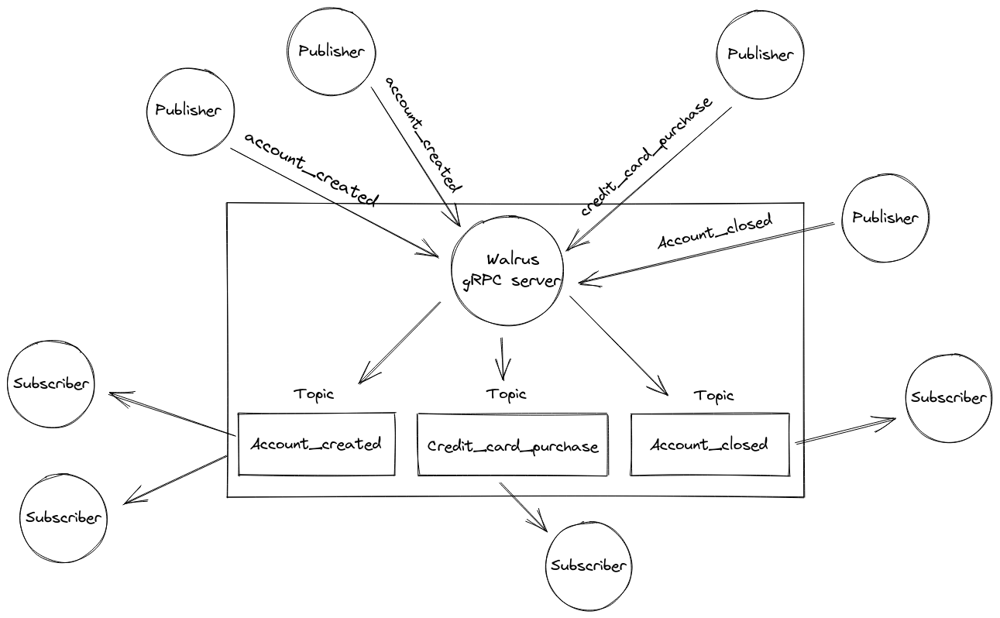

<h3 align="center">Walrus</h3>
<p align="center">
  Real-time event streaming platform built on top of gRPC streams
</p>

<details open="open">
  <summary>Table of Contents</summary>
  <ol>
    <li>
      <a href="#about-the-project">About the project</a>
      <ul>
        <li><a href="#how-it-works">How it works</a></li>
        <li><a href="#built-with">Built With</a></li>
      </ul>
    </li>
    <li>
      <a href="#getting-started">Getting Started</a>
      <ul>
        <li><a href="#prerequisites">Prerequisites</a></li>
        <li><a href="#how-to-run">How to run and useful commands</a></li>
        <li><a href="#testing">Testing</a></li>
      </ul>
    </li>
    <li><a href="#usage">Usage</a></li>
    <li><a href="#contributing">Contributing</a></li>
    <li><a href="#license">License</a></li>
</details>

## About the Project

TODO

### How it works

Walrus uses pub/sub pattern to allow applications to subscribe to specific topics. A topic is any event or a concern that can happen on your systems, it can be a new account that was just created, or a credit card purchase. So any application that wants to be notified by new events, it will just need to subscribe to this topic. To make it possible, Walrus offers an rpc method called **Subscribe** which any service can call to establish a gRPC connection and start to listen for a server side message stream. Then, when a new event happen, any application can call the **Publish** rpc method to publish this event through Walrus that will send it to all subscriptions based on the event's topic. 




### Built With

* [Go](https://golang.org/)
* [gRPC](https://grpc.io/)

<!-- GETTING STARTED -->
## Getting Started

All you should know to run Walrus locally.

### Prerequisites

* [Go 1.16 or higher](https://laravel.com)
* [Buf](https://docs.buf.build/installation)

### How to run

1. Clone the repo
   ```bash
   git clone https://github.com/matheusmosca/walrus.git
   ```
2. Run the server
   ```bash
   make run-server
   ```

### Testing

```bash
make test
```

## Usage

TODO

## Contributing

Take a look at the [open issues](https://github.com/matheusmosca/walrus/issues) and let a comment on them if you want to help somehow. Feel free to share your ideas or report bugs by opening a new issue as well. Any contributions you make are really appreciated and I would love to review your pull requests.  :heart:

## License

Distributed under the APACHE-2.0 License. See `LICENSE` for more information.